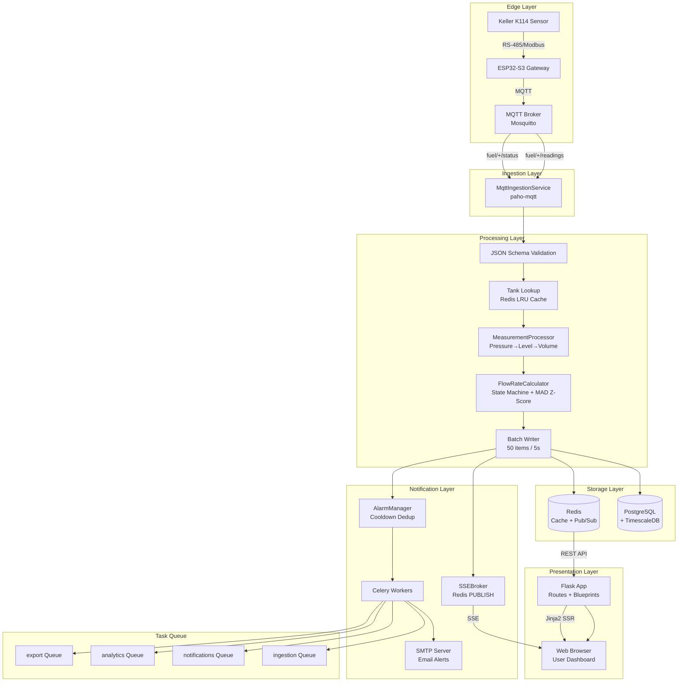
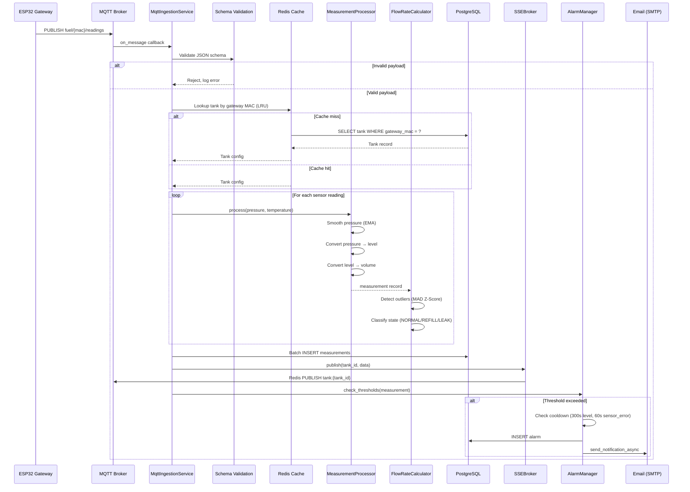
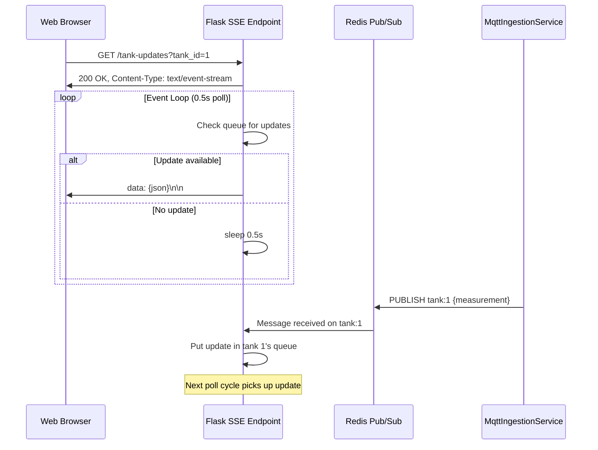
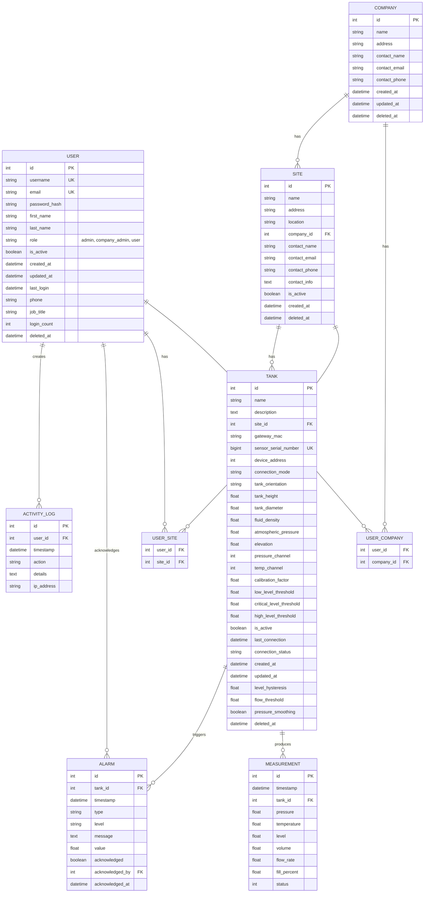
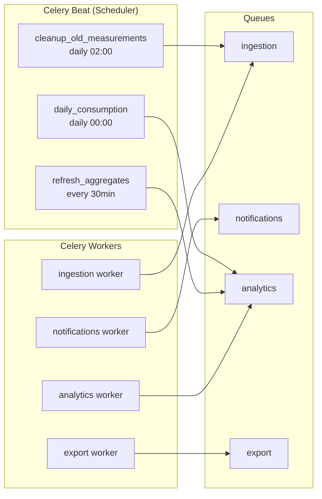

# Cloud Fuel Monitoring Platform — Technical Specification

**Version:** 1.0
**Date:** 2026-09-07
**Status:** Reference Document

---

## Table of Contents

1. [Executive Summary & Project Purpose](#1-executive-summary--project-purpose)
2. [System Architecture & High-Level Design](#2-system-architecture--high-level-design)
3. [Tech Stack & Environment Matrix](#3-tech-stack--environment-matrix)
4. [Data Architecture & Schema Specification](#4-data-architecture--schema-specification)
5. [API & Integration Contracts](#5-api--integration-contracts)
6. [Non-Functional Requirements & Operational Design](#6-non-functional-requirements--operational-design)
7. [Repository Map & Directory Layout](#7-repository-map--directory-layout)
8. [Technical Debt, Gaps & Recommendations](#8-technical-debt-gaps--recommendations)

---

## 1. Executive Summary & Project Purpose

### 1.1 Overview

The **Cloud Fuel Monitoring Platform** is an industrial IoT solution for real-time monitoring of fuel storage tanks deployed across distributed sites. The platform ingests pressure and temperature readings from Keller sensors connected to ESP32-S3 gateways via MQTT, processes raw sensor data into actionable metrics (level, volume, flow rate, fill percentage), and delivers this data through a web-based dashboard with alarm management, analytics, and multi-tenant administration.

### 1.2 Primary Objectives

- **Real-time visibility**: Sub-second telemetry ingestion with live dashboard updates via Server-Sent Events.
- **Multi-tenant hierarchy**: Companies → Sites → Tanks with role-based access control (admin, company_admin, user).
- **Operational safety**: Threshold-based alarm system with configurable level, critical, and high thresholds per tank; email notification integration.
- **Historical analytics**: Time-series storage with TimescaleDB hypertables, continuous aggregates, and data retention/compression policies.
- **Scalability**: Redis-backed broker, cache, pub/sub, and rate limiting; Celery task queue for asynchronous workloads.

### 1.3 Key Stakeholders

| Role | Responsibility |
|------|---------------|
| Platform Administrators | Full system control, user/company/site/tank CRUD, system health monitoring |
| Company Administrators | Company-scoped site and tank management, user access within company |
| Site Users | View tank telemetry, acknowledge alarms, view reports |
| Firmware Engineers | ESP32-S3 gateway firmware, Keller sensor integration |

---

## 2. System Architecture & High-Level Design

### 2.1 Architecture Overview



### 2.2 Data Flow — MQTT Ingestion Pipeline



### 2.3 Data Flow — SSE Real-Time Push



### 2.4 MQTT Topic Structure

| Topic Pattern | Direction | Purpose |
|---------------|-----------|---------|
| `fuel/+/readings` | Subscribe | Sensor data from gateways |
| `fuel/+/status` | Subscribe | Gateway online/offline status |
| `fuel/{mac}/commands` | Publish | Commands to specific gateway |
| `fuel/{mac}/errors` | Publish | Error messages to gateway |
| `fuel/service/status` | Publish (retained) | Platform service status |

### 2.5 MQTT Reading Payload Schema

```json
{
  "gateway_mac": "AA:BB:CC:DD:EE:FF",
  "site_id": 1,
  "timestamp": "2026-09-07T10:30:00Z",
  "sensors": [
    {
      "serial_number": 12345678,
      "device_address": 1,
      "pressure_bar": 0.5,
      "temperature_c": 22.5,
      "status": 0
    }
  ]
}
```

---

## 3. Tech Stack & Environment Matrix

### 3.1 Backend

| Component | Technology | Version Constraint |
|-----------|-----------|-------------------|
| Language | Python | 3.x |
| Web Framework | Flask | ≥ 3.0.0 |
| ORM | SQLAlchemy + Flask-SQLAlchemy | ≥ 2.0.0 / ≥ 3.1.0 |
| Migrations | Flask-Migrate (Alembic) | ≥ 4.0.0 |
| Session Auth | Flask-Login | ≥ 0.6.0 |
| Forms / CSRF | Flask-WTF | ≥ 1.2.0 |
| DB Driver | psycopg2-binary | ≥ 2.9.0 |
| Task Queue | Celery | ≥ 5.4.0 |
| Cache / Broker | Redis (via redis-py) | ≥ 5.0.0 |
| MQTT Client | paho-mqtt | ≥ 2.1.0 |
| Schema Validation | jsonschema | ≥ 4.21.0 |
| Env Config | python-dotenv | ≥ 1.0.0 |
| Password Hashing | PBKDF2 via werkzeug | (bundled with Flask) |

### 3.2 Database

| Component | Technology | Details |
|-----------|-----------|---------|
| Primary Store | PostgreSQL | Relational data |
| Time-Series Extension | TimescaleDB | Hypertables, continuous aggregates |
| Hypertable Chunk Interval | 1 day | On `measurement.timestamp` |
| Retention Policy | 90 days | Auto-drop expired chunks |
| Compression Policy | 7 days | Compress older data |
| Continuous Aggregates | `measurements_hourly`, `measurements_daily` | Pre-computed rollups |

### 3.3 Frontend

| Component | Technology | Details |
|-----------|-----------|---------|
| Templating | Jinja2 | Server-side rendering (57 templates) |
| CSS Framework | Tailwind CSS | Compiled locally via CLI |
| Charts | Chart.js v4 | Vendored UMD bundle |
| Chart Adapter | chartjs-adapter-date-fns | Vendored bundle |
| Icons | Lucide Icons | Vendored UMD bundle |
| JavaScript | Vanilla JS | No framework, no bundler (20 files) |
| i18n | Custom translation system | English + Arabic |

### 3.4 Infrastructure

| Component | Technology | Purpose |
|-----------|-----------|---------|
| Message Broker | Redis | Celery broker, SSE pub/sub, rate limiting, LRU cache, deduplication |
| MQTT Broker | Mosquitto (or equivalent) | IoT message transport |
| Email | SMTP Server | Alarm email notifications |
| Containerization | None | No Docker configuration found |
| CI/CD | None | No CI/CD pipeline found |

### 3.5 Environment Configuration

| Variable | Description | Required |
|----------|-------------|----------|
| `DATABASE_URL` | PostgreSQL connection string | Yes |
| `REDIS_URL` | Redis connection string | Yes |
| `SECRET_KEY` | Flask session signing key | Yes |
| `MQTT_BROKER` | MQTT broker hostname | Yes |
| `MQTT_PORT` | MQTT broker port | Yes |
| `MQTT_USER` | MQTT authentication username | No |
| `MQTT_PASS` | MQTT authentication password | No |
| `MQTT_TLS_ENABLED` | Enable TLS for MQTT connections | No |
| `CELERY_BROKER_URL` | Celery broker URL (defaults to Redis) | No |
| `SMTP_HOST` | SMTP server hostname | For email alerts |
| `SMTP_PORT` | SMTP server port | For email alerts |
| `SMTP_USER` | SMTP username | For email alerts |
| `SMTP_PASS` | SMTP password | For email alerts |
| `FORCE_HTTPS` | Enforce HTTPS redirect | No |
| `SESSION_COOKIE_SECURE` | Secure flag on session cookie | Production |

### 3.6 Configuration Classes

| Class | Use | CSRF | DB | Session |
|-------|-----|------|----|---------|
| `DevelopmentConfig` | Local dev | Enabled | PostgreSQL | Standard |
| `TestingConfig` | Unit tests | Disabled | In-memory SQLite | Standard |
| `ProductionConfig` | Deployment | Enabled | PostgreSQL | Secure, SameSite=Strict |

---

## 4. Data Architecture & Schema Specification

### 4.1 Entity-Relationship Diagram



### 4.2 Association Tables

#### `user_companies` (M2M)

| Column | Type | Constraint |
|--------|------|------------|
| `user_id` | Integer | FK → `user.id`, NOT NULL |
| `company_id` | Integer | FK → `company.id`, NOT NULL |

#### `user_sites` (M2M)

| Column | Type | Constraint |
|--------|------|------------|
| `user_id` | Integer | FK → `user.id`, NOT NULL |
| `site_id` | Integer | FK → `site.id`, NOT NULL |

### 4.3 SoftDeleteMixin

The `SoftDeleteMixin` provides logical deletion for the `User`, `Company`, `Site`, and `Tank` models without removing database rows.

| Field/Method | Type | Description |
|--------------|------|-------------|
| `deleted_at` | DateTime (nullable) | Timestamp of deletion; `NULL` = active |
| `soft_delete()` | Method | Sets `deleted_at` to current time |
| `restore()` | Method | Clears `deleted_at` |
| `is_deleted` | Property | Returns `True` if `deleted_at` is set |
| `not_deleted()` | Classmethod | Query filter for active records |

### 4.4 Model Specifications

#### 4.4.1 User (table: `user`)

| Column | Type | Constraints | Notes |
|--------|------|-------------|-------|
| `id` | Integer | PK, auto-increment | |
| `username` | String(64) | UNIQUE, NOT NULL, indexed | Login identifier |
| `email` | String(120) | UNIQUE, NOT NULL, indexed | Notification target |
| `password_hash` | String(120) | NOT NULL | PBKDF2 hashed |
| `first_name` | String(64) | nullable | |
| `last_name` | String(64) | nullable | |
| `role` | String(20) | indexed, default `'user'` | Enum: `admin`, `company_admin`, `user` |
| `is_active` | Boolean | indexed, default `True` | |
| `created_at` | DateTime | server_default `now()` | |
| `updated_at` | DateTime | server_default `now()`, onupdate `now()` | |
| `last_login` | DateTime | nullable | |
| `phone` | String(20) | nullable | |
| `job_title` | String(100) | nullable | |
| `login_count` | Integer | default `0` | |
| `deleted_at` | DateTime | nullable (SoftDeleteMixin) | |

**Relationships:**
- `companies`: M2M via `user_companies`
- `sites`: M2M via `user_sites`

**Methods:**
- `set_password(password)`: Hash and store password
- `check_password(password)`: Verify against stored hash
- `is_admin()`: Returns `True` if `role == 'admin'`
- `is_company_admin()`: Returns `True` if `role == 'company_admin'`
- `has_role(role_name)`: Returns `True` if user has the specified role
- `get_full_name()`: Returns formatted full name

#### 4.4.2 Company (table: `company`)

| Column | Type | Constraints | Notes |
|--------|------|-------------|-------|
| `id` | Integer | PK, auto-increment | |
| `name` | String(100) | NOT NULL, indexed | |
| `address` | String(200) | nullable | |
| `contact_name` | String(100) | nullable | |
| `contact_email` | String(100) | nullable | |
| `contact_phone` | String(20) | nullable | |
| `created_at` | DateTime | server_default `now()` | |
| `updated_at` | DateTime | server_default `now()`, onupdate `now()` | |
| `deleted_at` | DateTime | nullable (SoftDeleteMixin) | |

**Relationships:**
- `sites`: 1:N cascade delete-orphan

**Properties:**
- `tank_count`: Computed count of associated tanks

#### 4.4.3 Site (table: `site`)

| Column | Type | Constraints | Notes |
|--------|------|-------------|-------|
| `id` | Integer | PK, auto-increment | |
| `name` | String(100) | NOT NULL, indexed | |
| `address` | String(200) | nullable | |
| `location` | String(200) | nullable | |
| `company_id` | Integer | FK → `company.id`, NOT NULL, indexed | |
| `contact_name` | String(100) | nullable | |
| `contact_email` | String(100) | nullable | |
| `contact_phone` | String(20) | nullable | |
| `contact_info` | Text | nullable | |
| `is_active` | Boolean | indexed, default `True` | |
| `created_at` | DateTime | server_default `now()` | |
| `deleted_at` | DateTime | nullable (SoftDeleteMixin) | |

**Relationships:**
- `tanks`: 1:N cascade delete-orphan

**Methods:**
- `get_recent_alarms(limit)`: Returns recent alarms for the site

#### 4.4.4 Tank (table: `tank`)

| Column | Type | Constraints | Notes |
|--------|------|-------------|-------|
| `id` | Integer | PK, auto-increment | |
| `name` | String(100) | NOT NULL, indexed | |
| `description` | Text | nullable | |
| `site_id` | Integer | FK → `site.id`, NOT NULL, indexed | |
| `gateway_mac` | String(17) | nullable, indexed | ESP32 MAC address |
| `sensor_serial_number` | BigInteger | nullable, unique, indexed | Keller sensor serial |
| `device_address` | Integer | default `1` | Modbus device address |
| `connection_mode` | String(20) | default `'mqtt'` | |
| `tank_orientation` | String(20) | default `'vertical'` | `vertical` or `horizontal` |
| `tank_height` | Float | default `2.0` | Meters |
| `tank_diameter` | Float | default `1.5` | Meters |
| `fluid_density` | Float | default `850` | kg/m³ |
| `atmospheric_pressure` | Float | default `0.0` | Bar |
| `elevation` | Float | default `2250.0` | Meters above sea level |
| `pressure_channel` | Integer | default `1` | |
| `temp_channel` | Integer | default `4` | |
| `calibration_factor` | Float | default `1.0` | |
| `low_level_threshold` | Float | default `20.0` | Percentage |
| `critical_level_threshold` | Float | default `10.0` | Percentage |
| `high_level_threshold` | Float | default `90.0` | Percentage |
| `is_active` | Boolean | indexed, default `True` | |
| `last_connection` | DateTime | nullable | Last MQTT message received |
| `connection_status` | String(20) | default `'disconnected'` | `online`, `offline`, `disconnected` |
| `created_at` | DateTime | server_default `now()` | |
| `updated_at` | DateTime | server_default `now()`, onupdate `now()` | |
| `level_hysteresis` | Float | nullable | Dead-band for level alarm |
| `flow_threshold` | Float | nullable | Flow rate alarm threshold |
| `pressure_smoothing` | Boolean | default `True` | Enable EMA smoothing |
| `deleted_at` | DateTime | nullable (SoftDeleteMixin) | |

**Table Args:**
- Composite index on `(site_id, is_active)`

**Relationships:**
- `measurements`: 1:N cascade delete-orphan
- `alarms`: 1:N cascade delete-orphan

**Methods:**
- `get_latest_measurement()`: Returns most recent measurement
- `get_recent_measurements(limit)`: Returns recent measurements
- `get_connection_status()`: Returns connection status dict
- `get_recent_alarms(limit)`: Returns recent alarms
- `get_current_volume()`: Returns computed current volume

#### 4.4.5 Measurement (table: `measurement`) — TimescaleDB Hypertable

| Column | Type | Constraints | Notes |
|--------|------|-------------|-------|
| `id` | Integer | PK, auto-increment | |
| `timestamp` | DateTime | NOT NULL, server_default `now()` | Hypertable partition key |
| `tank_id` | Integer | FK → `tank.id`, NOT NULL | |
| `pressure` | Float | NOT NULL | Bar |
| `temperature` | Float | nullable | Celsius |
| `level` | Float | NOT NULL | Computed level (meters or percentage) |
| `volume` | Float | NOT NULL | Computed volume |
| `flow_rate` | Float | NOT NULL | m³/h |
| `fill_percent` | Float | NOT NULL | 0-100% |
| `status` | Integer | NOT NULL | Sensor status code |

**Table Args:**
- Composite index on `(tank_id, timestamp)`

**TimescaleDB Configuration:**

| Policy | Configuration |
|--------|--------------|
| Hypertable | Partition on `timestamp`, 1-day chunks |
| Retention | 90 days — auto-drop expired chunks |
| Compression | 7 days — compress older data |
| Continuous Aggregate | `measurements_hourly` — hourly rollups |
| Continuous Aggregate | `measurements_daily` — daily rollups |

**Methods:**
- `to_dict()`: Serialize to dictionary
- `get_aggregated()`: Classmethod for aggregated queries
- `get_daily_consumption()`: Classmethod for daily usage rollup
- `get_hourly_consumption()`: Classmethod for hourly usage rollup

#### 4.4.6 Alarm (table: `alarm`)

| Column | Type | Constraints | Notes |
|--------|------|-------------|-------|
| `id` | Integer | PK, auto-increment | |
| `tank_id` | Integer | FK → `tank.id`, NOT NULL, indexed | |
| `timestamp` | DateTime | server_default `now()`, indexed | |
| `type` | String(50) | NOT NULL, indexed | `low_level`, `critical_level`, `high_level`, `sensor_error`, etc. |
| `level` | String(20) | indexed, default `'warning'` | `warning`, `critical`, `info` |
| `message` | Text | NOT NULL | Human-readable alarm description |
| `value` | Float | nullable | Trigger value |
| `acknowledged` | Boolean | indexed, default `False` | |
| `acknowledged_by` | Integer | FK → `user.id`, nullable | |
| `acknowledged_at` | DateTime | nullable | |

**Table Args:**
- Composite index on `(tank_id, type, acknowledged)`

**Relationships:**
- `acknowledger`: M2O → User

**Methods:**
- `to_dict()`: Serialize to dictionary
- `to_dict_loaded()`: Serialize with related objects loaded

#### 4.4.7 ActivityLog (table: `activity_log`)

| Column | Type | Constraints | Notes |
|--------|------|-------------|-------|
| `id` | Integer | PK, auto-increment | |
| `user_id` | Integer | FK → `user.id`, nullable | `NULL` for system actions |
| `timestamp` | DateTime | server_default `now()`, indexed | |
| `action` | String(100) | NOT NULL | e.g., `login`, `create_tank`, `acknowledge_alarm` |
| `details` | Text | nullable | JSON or free-text details |
| `ip_address` | String(45) | nullable | Supports IPv6 |

**Relationships:**
- `user`: M2O → User

### 4.5 Non-Database Models

| Class | Purpose | Key Behavior |
|-------|---------|-------------|
| `TankConfig` | Tank configuration serialization | `from_database()` factory method |
| `MeasurementProcessor` | Thread-safe pressure-to-level/volume conversion | EMA smoothing, orientation-aware volume calculation |
| `FlowRateCalculator` | State machine for flow analysis | States: NORMAL, REFILL, STABLE, HIGH_OUTFLOW, LEAK_DETECTED; MAD z-score outlier detection |
| `AlarmManager` | Alarm creation with cooldown deduplication | Cooldown: 300s for level alarms, 60s for sensor_error |
| `StatisticsTracker` | In-memory running statistics | Mean, variance, min/max tracking |
| `DataLogger` | CSV file logger | Raw data logging for debugging |
| `KellerProtocol` | Keller bus protocol implementation | CRC-16, request/response parsing |
| `K114Reader` | Abstract base for K114 serial converter | RS-485 communication |

---

## 5. API & Integration Contracts

### 5.1 Route Summary

| Blueprint | Route Count | Prefix | Description |
|-----------|-------------|--------|-------------|
| Auth (`auth.py`) | 7 | `/` | Login, password reset, profile |
| User (`app.py`) | 19 | `/` | Dashboard, tanks, alarms, API endpoints |
| Admin (`admin.py`) | 98 | `/admin` | Full system administration |
| **Total** | **124+** | | |

### 5.2 Authentication Routes (auth.py)

| Method | Endpoint | Function | Auth Required | Rate Limit |
|--------|----------|----------|---------------|------------|
| GET/POST | `/login` | `auth.login` | No | 5 requests / 15 min |
| GET | `/logout` | `auth.logout` | Yes | — |
| GET/POST | `/change_password` | `auth.change_password` | Yes | — |
| GET/POST | `/reset_password_request` | `auth.reset_password_request` | No | 3 requests / hour |
| GET/POST | `/reset_password/<token>` | `auth.reset_password` | No | — |
| GET | `/profile` | `auth.profile` | Yes | — |
| GET/POST | `/edit_profile` | `auth.edit_profile` | Yes | — |

### 5.3 User-Facing Routes (app.py)

| Method | Endpoint | Function | Auth Required |
|--------|----------|----------|---------------|
| GET | `/` | `index` | No (redirects if authenticated) |
| GET | `/dashboard` | `dashboard` | Yes |
| GET | `/tanks` | `tanks` | Yes |
| GET | `/tanks/<id>` | `tank_detail` | Yes |
| GET | `/tanks/<id>/history` | `tank_history` | Yes |
| GET | `/tanks/<id>/consumption` | `tank_consumption` | Yes |
| GET/POST | `/tanks/<id>/calibration` | `tank_calibration` | Yes |
| GET | `/alarms` | `alarms` | Yes |
| POST | `/alarms/acknowledge/<id>` | `acknowledge_alarm` | Yes |
| GET | `/tank-updates` | SSE endpoint | Yes (`@login_required`) |
| GET | `/api/tanks/<id>/measurements` | `api_tank_measurements` | Yes |
| GET | `/api/tank/<id>/history` | `api_tank_history` | Yes |
| GET | `/api/tanks/<id>/forecast` | `api_tank_forecast` | Yes (1hr cache) |
| POST | `/api/tanks/<id>/forecast/clear-cache` | `clear_forecast_cache` | Yes |
| GET | `/api/tanks/<id>/stats` | `api_tank_stats` | Yes |
| GET | `/api/alarms` | `api_alarms` | Yes |
| GET | `/api/statistics/daily-usage` | `daily_usage` | Yes |
| GET | `/api/history` | `api_history` | Yes |
| GET | `/api/events/<id>` | `api_event_detail` | Yes |
| GET | `/download/tank/<id>/csv` | `download_tank_csv` | Yes |
| GET | `/favicon.ico` | `favicon` | No |

### 5.4 Admin Routes (admin.py)

#### 5.4.1 Dashboard & System (11 routes)

| Method | Endpoint | Function |
|--------|----------|----------|
| GET | `/admin/` | `admin_index` |
| GET | `/admin/dashboard` | `dashboard` |
| GET | `/admin/api/stats` | `api_stats` |
| GET | `/admin/api/system-status` | `system_status` |
| GET | `/admin/api/system-health` | `api_system_health` |
| GET | `/admin/api/system-logs` | `api_system_logs` |
| GET | `/admin/system-logs` | `system_logs` |
| GET/POST | `/admin/system-settings` | `system_settings` |
| GET | `/admin/api/dashboard-chart-data` | `api_dashboard_chart_data` |
| GET | `/admin/api/tank-status-counts` | `api_tank_status_counts` |
| GET | `/admin/api/alarm-counts` | `api_alarm_counts` |
| GET | `/admin/api/recent-activities` | `api_recent_activities` |

#### 5.4.2 Charts (4 routes)

| Method | Endpoint | Function |
|--------|----------|----------|
| GET | `/admin/api/charts/tank-levels` | `api_chart_tank_levels` |
| GET | `/admin/api/charts/daily-usage` | `api_chart_daily_usage` |
| GET | `/admin/api/charts/alarm-distribution` | `api_chart_alarm_distribution` |
| GET | `/admin/api/charts/connection-status` | `api_chart_connection_status` |

#### 5.4.3 Alarm Management (6 routes)

| Method | Endpoint | Function |
|--------|----------|----------|
| GET | `/admin/alarms` | `alarms_index` |
| POST | `/admin/alarms/acknowledge/<id>` | `acknowledge_alarm` |
| POST | `/admin/alarms/delete/<id>` | `delete_alarm` |
| POST | `/admin/alarms/clear-all` | `clear_all_alarms` |
| POST | `/admin/alarms/acknowledge-all` | `acknowledge_all_alarms` |
| GET | `/admin/api/alarms` | `api_alarms` |

#### 5.4.4 User Management (16 routes)

| Method | Endpoint | Function |
|--------|----------|----------|
| GET | `/admin/users` | `users` |
| GET/POST | `/admin/users/create` | `new_user` |
| GET/POST | `/admin/users/edit/<id>` | `edit_user` |
| POST | `/admin/users/delete/<id>` | `delete_user` |
| GET/POST | `/admin/users/access/<id>` | `user_access` |
| GET | `/admin/api/users` | `api_users` |
| GET | `/admin/api/users/<id>` | `api_user_detail` |
| POST | `/admin/api/users/create` | `api_create_user` |
| POST | `/admin/api/users/update` | `api_update_user` |
| POST | `/admin/api/users/delete/<id>` | `api_delete_user` |
| POST | `/admin/api/users/<id>/reset-password` | `reset_user_password` |
| POST | `/admin/users/bulk-action` | `bulk_action_users` |
| POST | `/admin/users/restore/<id>` | `restore_user` |
| POST | `/admin/users/permanent-delete/<id>` | `permanent_delete_user` |
| POST | `/admin/api/users/restore/<id>` | `api_restore_user` |
| POST | `/admin/api/users/permanent-delete/<id>` | `api_permanent_delete_user` |
| GET | `/admin/api/user-permissions/<id>` | `api_user_permissions` |

#### 5.4.5 Company Management (14 routes)

| Method | Endpoint | Function |
|--------|----------|----------|
| GET | `/admin/companies` | `companies` |
| GET | `/admin/companies/<id>` | `company_detail` |
| GET/POST | `/admin/companies/create` | `create_company` |
| GET/POST | `/admin/companies/edit/<id>` | `edit_company` |
| POST | `/admin/companies/delete/<id>` | `delete_company` |
| GET | `/admin/api/companies` | `api_companies` |
| GET | `/admin/api/companies/<id>/stats` | `api_company_stats` |
| GET | `/admin/api/companies/<id>/sites` | `api_company_sites` |
| GET | `/admin/api/companies/<id>/alarms` | `api_company_alarms` |
| POST | `/admin/companies/bulk-action` | `bulk_action_companies` |
| POST | `/admin/companies/restore/<id>` | `restore_company` |
| POST | `/admin/companies/permanent-delete/<id>` | `permanent_delete_company` |
| POST | `/admin/api/companies/restore/<id>` | `api_restore_company` |
| POST | `/admin/api/companies/permanent-delete/<id>` | `api_permanent_delete_company` |

#### 5.4.6 Site Management (14 routes)

| Method | Endpoint | Function |
|--------|----------|----------|
| GET | `/admin/sites` | `sites` |
| GET | `/admin/sites/<id>` | `site_detail` |
| GET/POST | `/admin/sites/create` | `create_site` |
| GET/POST | `/admin/sites/edit/<id>` | `edit_site` |
| POST | `/admin/sites/delete/<id>` | `delete_site` |
| GET | `/admin/api/sites` | `api_sites` |
| GET | `/admin/api/sites/<id>/stats` | `api_site_stats` |
| GET | `/admin/api/sites/<id>/tanks` | `api_site_tanks` |
| GET | `/admin/api/sites/<id>/alarms` | `api_site_alarms` |
| POST | `/admin/sites/bulk-action` | `bulk_action_sites` |
| POST | `/admin/sites/restore/<id>` | `restore_site` |
| POST | `/admin/sites/permanent-delete/<id>` | `permanent_delete_site` |
| POST | `/admin/api/sites/restore/<id>` | `api_restore_site` |
| POST | `/admin/api/sites/permanent-delete/<id>` | `api_permanent_delete_site` |

#### 5.4.7 Tank Management (23 routes)

| Method | Endpoint | Function |
|--------|----------|----------|
| GET | `/admin/tanks` | `tanks_index` |
| GET | `/admin/tanks/<id>` | `tank_detail` |
| GET/POST | `/admin/tanks/create` | `create_tank` |
| GET/POST | `/admin/tanks/edit/<id>` | `edit_tank` |
| POST | `/admin/tanks/delete/<id>` | `delete_tank` |
| GET | `/admin/tanks/<id>/consumption` | `tank_consumption` |
| GET | `/admin/api/tanks` | `api_tanks` |
| GET | `/admin/api/tanks/<id>/measurements` | `api_tank_measurements` |
| GET | `/admin/api/tanks/<id>/alarms` | `api_tank_alarms` |
| GET | `/admin/api/tanks/<id>/history` | `api_tank_history` |
| GET | `/admin/api/tanks/<id>/individual-consumption` | `api_tank_individual_consumption` |
| GET | `/admin/api/tanks/<id>/hourly-stats` | `api_tank_hourly_stats` |
| GET | `/admin/api/tanks/<id>/consumption-patterns` | `api_tank_consumption_patterns` |
| GET | `/admin/api/tanks/<id>/weekly-pattern` | `api_tank_weekly_pattern` |
| GET | `/admin/api/tanks/<id>/hourly-pattern` | `api_tank_hourly_pattern` |
| GET | `/admin/api/tanks/<id>/daily-stats` | `api_tank_daily_stats` |
| POST | `/admin/api/tanks/<id>/test-connection` | `api_tank_test_connection` |
| POST | `/admin/api/tanks/<id>/calibrate` | `api_tank_calibrate` |
| POST | `/admin/api/tanks/<id>/reset` | `api_tank_reset` |
| POST | `/admin/tanks/bulk-action` | `bulk_action_tanks` |
| POST | `/admin/tanks/restore/<id>` | `restore_tank` |
| POST | `/admin/tanks/permanent-delete/<id>` | `permanent_delete_tank` |
| POST | `/admin/api/tanks/restore/<id>` | `api_restore_tank` |
| POST | `/admin/api/tanks/permanent-delete/<id>` | `api_permanent_delete_tank` |

#### 5.4.8 Reports (8 routes)

| Method | Endpoint | Function |
|--------|----------|----------|
| GET | `/admin/reports` | `reports` |
| GET | `/admin/reports/usage` | `usage_report` |
| GET | `/admin/api/reports/usage` | `api_usage_report` |
| GET | `/admin/reports/alarms` | `alarm_report` |
| GET | `/admin/api/reports/alarms` | `api_alarm_report` |
| GET | `/admin/reports/inventory` | `inventory_report` |
| GET | `/admin/api/reports/inventory` | `api_inventory_report` |
| GET/POST | `/admin/reports/export` | `export_report` |

#### 5.4.9 Activity, Logs, Deleted Records, Backups (8 routes)

| Method | Endpoint | Function |
|--------|----------|----------|
| GET | `/admin/activity-log` | `activity_log` |
| GET | `/admin/api/activity-log` | `api_activity_log` |
| GET | `/admin/deleted-records` | `deleted_records` |
| GET | `/admin/api/deleted-records` | `api_deleted_records` |
| GET | `/admin/backup-database` | `backup_database` |
| GET | `/admin/download-backup/<filename>` | `download_backup` |
| POST | `/admin/restore-backup/<id>` | `restore_backup` |
| POST | `/admin/delete-backup/<id>` | `delete_backup` |

#### 5.4.10 Roles & Permissions (4 routes)

| Method | Endpoint | Function |
|--------|----------|----------|
| GET | `/admin/roles` | `roles` |
| GET | `/admin/api/roles` | `api_roles` |
| GET | `/admin/api/permissions` | `api_permissions` |
| GET | `/admin/api/role-permissions` | `api_role_permissions` |

### 5.5 SSE Endpoint Contract

**Endpoint:** `GET /tank-updates?tank_id=<int>`

**Response Headers:**
```
Content-Type: text/event-stream
Cache-Control: no-cache
Connection: keep-alive
X-Accel-Buffering: no
```

**Event Format:**
```
data: {"tank_id": 1, "level": 75.2, "volume": 1234.5, "flow_rate": 0.5, "fill_percent": 75.2, "timestamp": "2026-09-07T10:30:00Z"}\n\n
```

**Behavior:**
- Generator-based response with 0.5s polling interval
- Cleanup on `GeneratorExit` (client disconnect)
- Auth required (`@login_required`)

### 5.6 MQTT Integration Contract

#### Subscribe Topics

| Topic | Payload | Processing |
|-------|---------|-----------|
| `fuel/+/readings` | Reading JSON | Full ingestion pipeline |
| `fuel/+/status` | Status JSON | Update tank connection status |

#### Publish Topics

| Topic | Payload | Purpose |
|-------|---------|---------|
| `fuel/{mac}/commands` | Command JSON | Send commands to gateway |
| `fuel/{mac}/errors` | Error JSON | Report errors to gateway |
| `fuel/service/status` | Status JSON (retained) | Platform health broadcast |

#### Connection Parameters

| Parameter | Value |
|-----------|-------|
| Reconnection | Exponential backoff: 1s → 120s max |
| TLS | Optional (`MQTT_TLS_ENABLED`) |
| Auth | Optional (`MQTT_USER` / `MQTT_PASS`) |

---

## 6. Non-Functional Requirements & Operational Design

### 6.1 Performance

| Metric | Target | Implementation |
|--------|--------|---------------|
| MQTT ingestion latency | < 100ms end-to-end | Batch writes (50 items / 5s), Redis LRU cache |
| Dashboard update latency | < 2s from measurement to UI | SSE with 0.5s polling, Redis pub/sub |
| API response time | < 500ms (p95) | PostgreSQL indexing, Redis caching (1hr forecast cache) |
| Concurrent dashboard users | 50+ | SSE is lightweight, no WebSocket overhead |
| Measurement throughput | 1000+ measurements/minute | Batch DB writes, TimescaleDB hypertables |

### 6.2 Security

#### 6.2.1 Authentication & Authorization

| Control | Implementation |
|---------|---------------|
| Session management | Flask-Login, 30-minute session lifetime |
| Role-Based Access Control | Three roles: `admin`, `company_admin`, `user` |
| Authorization decorator | `admin_required` for admin routes |
| Tank-level access | `check_tank_access()` per-tank authorization |
| Password hashing | PBKDF2 via werkzeug |
| Session fixation | Broken — `session.regenerate = True` is not a valid Flask mechanism (see §8.1) |

#### 6.2.2 Security Headers

| Header | Value |
|--------|-------|
| Content-Security-Policy | `self`; `unsafe-inline` (scripts) |
| X-Content-Type-Options | `nosniff` |
| X-Frame-Options | `DENY` |
| X-XSS-Protection | Enabled |
| Referrer-Policy | Set |
| Permissions-Policy | Set |
| HSTS | Enforced on TLS connections |

#### 6.2.3 Rate Limiting

| Endpoint | Limit | Window |
|----------|-------|--------|
| `/login` | 5 requests | 15 minutes |
| `/reset_password_request` | 3 requests | 1 hour |
| API endpoints | 60 requests | 1 minute |
| Implementation | Redis sliding window | Fail-open when Redis unavailable |

#### 6.2.4 Input Validation

| Layer | Mechanism |
|-------|-----------|
| Forms | WTForms validators (server-side) |
| MQTT payloads | JSON Schema validation via jsonschema library |
| API parameters | Flask request validation |

#### 6.2.5 CSRF Protection

- Flask-WTF `CSRFProtect` enabled globally
- All POST/PUT/DELETE forms include CSRF token

#### 6.2.6 HTTPS Enforcement

- Optional via `FORCE_HTTPS` configuration
- Production config enables `SESSION_COOKIE_SECURE=True` and `SameSite=Strict`

### 6.3 Scalability

| Dimension | Current Approach | Limitation |
|-----------|-----------------|------------|
| Horizontal (app) | Multiple Flask instances behind load balancer | Redis session store required |
| Horizontal (MQTT) | Single broker (Mosquitto) | Broker clustering not configured |
| Vertical (DB) | TimescaleDB hypertables with compression | 90-day retention limits historical depth |
| Vertical (Redis) | Single instance, multiple roles | No Redis Cluster/Sentinel |

### 6.4 Availability

| Component | Strategy |
|-----------|----------|
| MQTT | Exponential backoff reconnection (1s → 120s) |
| Redis | Fail-open for rate limiting; in-memory fallback for SSE |
| Database | SQLAlchemy connection pooling (`connection_pool.py`) |
| Task queue | Celery with Redis broker, multiple queues for isolation |

### 6.5 Data Retention & Archival

| Policy | Configuration |
|--------|--------------|
| Measurement retention | 90 days (auto-drop expired TimescaleDB chunks) |
| Compression | 7 days (compress older chunks) |
| Continuous aggregates | Hourly and daily rollups |
| Soft delete | User, Company, Site, Tank — retained with `deleted_at` |
| Database backups | Manual via `scripts/backup.sh`, admin UI |

### 6.6 Task Queue Architecture



| Queue | Tasks |
|-------|-------|
| `ingestion` | `process_measurements`, `check_alarms`, `cleanup_old_measurements` |
| `notifications` | `send_notification` |
| `analytics` | `generate_forecast`, `daily_consumption`, `refresh_aggregates` |
| `export` | `generate_csv` |

---

## 7. Repository Map & Directory Layout

### 7.1 Top-Level Structure

```
/home/ubuntu/fuel_monitoring/
├── app.py                          # Main Flask app, routes, SSEBroker, MqttIngestionService
├── admin.py                        # Admin blueprint (monolithic, 4400+ lines)
├── auth.py                         # Auth blueprint (login, password reset)
├── config.py                       # Configuration classes (dev/test/prod)
├── models.py                       # Re-exports from models/database.py
├── celery_app.py                   # Celery factory
├── mqtt_handler.py                 # MQTT handler wrapper
├── tailwind.config.js              # Tailwind configuration
├── custom_translations.py          # i18n translation loader
├── requirements.txt                # Python dependencies
├── .env                            # Environment variables (gitignored)
├── .gitignore                      # Git ignore rules
├── models/                         # Data models package
├── services/                       # Service layer
├── tasks/                          # Celery tasks
├── blueprints/                     # Blueprint package (partially integrated)
├── utils/                          # Utility modules
├── scripts/                        # Utility scripts
├── migrations/                     # Alembic migrations
├── translations/                   # i18n JSON translations
├── templates/                      # 57 Jinja2 templates
├── static/                         # Static assets (CSS, JS, vendor libs)
├── firmware/                       # ESP32 MicroPython firmware
└── docs/                           # Documentation
```

### 7.2 Detailed Module Map

#### `models/` — Data Models Package

| File | Purpose |
|------|---------|
| `database.py` | SQLAlchemy models: User, Company, Site, Tank, Measurement, Alarm, ActivityLog |
| `base_model.py` | `BaseModel` mixin with `to_dict()` serialization |
| `tank_config.py` | `TankConfig` — serialization and `from_database()` factory |
| `measurement_processor.py` | `MeasurementProcessor` — pressure smoothing, level/volume conversion |
| `flow_rate_calculator.py` | `FlowRateCalculator` — state machine (NORMAL/REFILL/STABLE/HIGH_OUTFLOW/LEAK_DETECTED), MAD z-score outlier detection |
| `alarm_manager.py` | `AlarmManager` — alarm creation with cooldown-based deduplication |
| `statistics_tracker.py` | `StatisticsTracker` — in-memory running statistics |
| `data_logger.py` | `DataLogger` — CSV file logging |
| `keller_protocol.py` | `KellerProtocol` — CRC-16, request/response parsing |
| `k114_reader.py` | `K114Reader` — abstract base for K114 serial converter |
| `base/sensor_connection.py` | Abstract sensor interface |

#### `services/` — Service Layer

| File | Purpose |
|------|---------|
| `mqtt_ingestion.py` | `MqttIngestionService` — main MQTT processing pipeline |
| `mqtt_gateway.py` | MQTT gateway management |

#### `tasks/` — Celery Tasks

| File | Tasks |
|------|-------|
| `ingestion.py` | `process_measurements`, `check_alarms`, `cleanup_old_measurements` |
| `analytics.py` | `generate_forecast`, `daily_consumption`, `refresh_aggregates` |
| `notifications.py` | `send_notification` |
| `export.py` | `generate_csv` |

#### `utils/` — Utility Modules

| File | Purpose | Status |
|------|---------|--------|
| `security.py` | CSP headers, security middleware | Active |
| `rate_limiter.py` | Redis sliding window rate limiter | Active |
| `helpers.py` | General helpers | Active |
| `connection_pool.py` | Database connection pooling | Active |
| `error_handling.py` | Error handling decorator | **Broken** — missing `functools` import |

#### `blueprints/admin/` — Refactored Admin Blueprint (Not Fully Integrated)

| File | Purpose |
|------|---------|
| `__init__.py` | Blueprint initialization |
| `auth.py` | Admin authentication |
| `users.py` | User management |
| `companies.py` | Company management |
| `sites.py` | Site management |
| `tanks.py` | Tank management |
| `alarms.py` | Alarm management |
| `dashboard.py` | Admin dashboard |
| `reports.py` | Report generation |
| `utils.py` | Shared utilities |

#### `scripts/` — Utility Scripts

| File | Purpose |
|------|---------|
| `backup.sh` | Database backup script |
| `migrate_admin.py` | Admin data migration |
| `migrate_sqlite_to_timescaledb.py` | SQLite → TimescaleDB migration |
| `migrate_to_timescaledb.py` | General migration to TimescaleDB |

### 7.3 Frontend Asset Map

#### Templates (57 total)

| Directory | Count | Description |
|-----------|-------|-------------|
| `templates/` | 8 | User-facing base, dashboard, tanks, alarms, errors |
| `templates/auth/` | 4 | Login, profile, change password, reset password |
| `templates/errors/` | 2 | 404, 500 error pages |
| `templates/components/` | 1 | Language switcher partial |
| `templates/admin/` | ~30 | Admin dashboard, CRUD, reports |

**Base Layouts:** Two independent layouts:
- `templates/base.html` — Top navbar (user-facing)
- `templates/admin/base.html` — Sidebar (admin)

#### JavaScript Files (20 total)

| File | Purpose | Notes |
|------|---------|-------|
| `main.js` | Global utilities (sidebar, alerts, loading, formatting) | |
| `sse-client.js` | SSE auto-reconnect wrapper | |
| `chart-factory.js` | Chart.js v4 configuration factory | |
| `charts.js` | Legacy chart utilities | |
| `dashboard.js` | Dashboard helpers | |
| `tank_detail.js` | Tank detail helpers | |
| `tank_history.js` | Tank history charts + export (1892 lines) | |
| `calibration.js` | Calibration live updates | |
| `consumption_analysis.js` | Consumption + pattern charts | **Uses Highcharts via CDN** |
| `history.js` | History page charts + table | |
| `alarms.js` | Placeholder (empty) | |
| `admin_dashboard.js` | Admin dashboard charts | |
| `admin_tanks.js` | Admin tank list CRUD | |
| `admin_sites.js` | Admin site list CRUD | |
| `admin_companies.js` | Admin company list CRUD | |
| `admin_users.js` | Admin user list CRUD | |
| `admin_alarms.js` | Admin alarm management | |
| `admin_site_detail.js` | Admin site detail | |
| `admin_tank_detail.js` | Admin tank detail (procedural) | |
| `admin/tank_detail.js` | Admin tank detail (OOP refactor) | |

#### Vendored Libraries

| Library | File | Notes |
|---------|------|-------|
| Chart.js v4 | `vendor/chart.umd.min.js` | Plus source map |
| chartjs-adapter-date-fns | `vendor/chartjs-adapter-date-fns.bundle.min.js` | |
| Lucide Icons | `vendor/lucide.min.js` | Plus source map |

### 7.4 Migrations

| Directory | Contents |
|-----------|----------|
| `migrations/versions/` | 6 Alembic migration files |

---

## 8. Technical Debt, Gaps & Recommendations

### 8.1 Critical Issues

| ID | Issue | Impact | Recommendation |
|----|-------|--------|----------------|
| C1 | **Session fixation prevention is broken** — `session.regenerate = True` is not a valid Flask mechanism | Session hijacking risk | Implement proper session regeneration using `flask.session.clear()` and re-login flow |
| C2 | **Zero test coverage** — Only 1 test file with 3 unit tests for hardware | No regression safety; deployment risk | Implement test suite covering models, services, tasks, and routes |
| C3 | **Weak database credentials in .env** — `fuel_pass` is trivially guessable | Database compromise risk | Use strong, randomly generated passwords; rotate regularly |
| C4 | **Broken utility files** — `error_handling.py` missing `functools` import, `data_logger.py` missing `time` import | Runtime errors on import | Fix missing imports |

### 8.2 High Priority

| ID | Issue | Impact | Recommendation |
|----|-------|--------|----------------|
| H1 | **CSP allows `unsafe-inline` for scripts** | XSS protection weakened | Refactor inline scripts to external files; use nonces if inline is unavoidable |
| H2 | **MQTT TLS disabled by default while firmware defaults to TLS** | Connection mismatch | Align default configurations; document TLS setup |
| H3 | **Duplicate admin module** — `admin.py` (monolithic, 4400+ lines) + `blueprints/admin/` (refactored, partially integrated) | Maintenance confusion, potential route conflicts | Complete blueprint migration; deprecate monolithic `admin.py` |
| H4 | **Password complexity not enforced on self-service change** | Weak passwords | Add complexity validators (length, character classes) |
| H5 | **Rate limiter fails open when Redis unavailable** | Abuse potential under Redis failure | Implement fallback: local in-memory rate limiting or fail-closed with graceful degradation |

### 8.3 Medium Priority

| ID | Issue | Impact | Recommendation |
|----|-------|--------|----------------|
| M1 | **No `.env.example` file** | Onboarding friction | Create `.env.example` with all documented variables |
| M2 | **Password reset token verification loads all users into memory** | O(n) memory usage | Optimize to query by token directly |
| M3 | **Error messages may leak internal details** | Information disclosure | Sanitize error messages before returning to clients |
| M4 | **Unbounded in-memory `forecast_cache`** | Memory leak over time | Add TTL-based eviction or LRU eviction |
| M5 | **Hardcoded stub for `daily_usage` data** | Incomplete analytics | Implement actual daily usage calculation |
| M6 | **Incomplete blueprint migration** | Dead code, maintenance burden | Complete migration or remove blueprints/admin |
| M7 | **Two `tank_detail.js` implementations** | Confusion about which is active | Remove the unused implementation |

### 8.4 Low Priority

| ID | Issue | Impact | Recommendation |
|----|-------|--------|----------------|
| L1 | **No COOP/CORP/COEP headers** | Missing cross-origin isolation | Add headers if cross-origin isolation is needed |
| L2 | **No dependency vulnerability scanning** | Unknown vulnerabilities in dependencies | Integrate `pip-audit` or `safety` into CI |
| L3 | **No audit logging for all sensitive operations** | Incomplete audit trail | Expand `ActivityLog` coverage to all sensitive operations |
| L4 | **Migration scripts use f-strings in SQL** | SQL injection risk in scripts | Use parameterized queries in migration scripts |
| L5 | **No CORS configuration for API endpoints** | APIs inaccessible from other origins (if needed) | Add CORS configuration if cross-origin API access is required |
| L6 | **Highcharts CDN dependency in `consumption_analysis.js`** | Inconsistent with vendored approach; external dependency | Vendor Highcharts or migrate to Chart.js for consistency |

### 8.5 Architectural Observations

| Observation | Detail |
|-------------|--------|
| **Monolithic admin blueprint** | `admin.py` at 4400+ lines contains 98 routes. The `blueprints/admin/` refactor exists but is not fully integrated. Completing this migration would improve maintainability. |
| **Mixed frontend dependencies** | Chart.js is vendored locally, but `consumption_analysis.js` pulls Highcharts from CDN. `tank_history.js` references jsPDF and SheetJS via CDN. Standardize on vendored libraries. |
| **i18n system** | Custom translation system with JSON files supports English and Arabic. Language switcher component exists. Consider standardizing to Flask-Babel for broader ecosystem support. |
| **Two base layouts** | User-facing (`base.html`) and admin (`admin/base.html`) have independent layouts with different navigation patterns. This is intentional but creates duplication. |
| **No containerization** | No Docker configuration. Deployment is manual. Consider adding Docker for reproducible deployments. |
| **No CI/CD** | No automated testing, linting, or deployment pipeline. Manual deployment only. |

---

*End of Technical Specification Document*
