# Entity-Relationship Diagram — Cloud Fuel & Dispensing Platform

## Complete ERD

```mermaid
erDiagram
    USER {
        uuid id PK
        varchar username UK
        varchar email UK
        varchar password_hash
        varchar first_name
        varchar last_name
        varchar role
        boolean is_active
        varchar phone
        varchar job_title
        int login_count
        timestamp created_at
        timestamp updated_at
        timestamp last_login
        timestamp deleted_at
    }

    COMPANY {
        uuid id PK
        varchar name UK
        varchar address
        varchar contact_name
        varchar contact_email
        varchar contact_phone
        timestamp created_at
        timestamp updated_at
        timestamp deleted_at
    }

    SITE {
        uuid id PK
        varchar name
        uuid company_id FK
        varchar address
        varchar location
        varchar contact_name
        varchar contact_email
        varchar contact_phone
        text contact_info
        boolean is_active
        timestamp created_at
        timestamp deleted_at
    }

    TANK {
        uuid id PK
        varchar name
        uuid site_id FK
        varchar gateway_mac
        bigint sensor_serial_number UK
        int device_address
        varchar connection_mode
        varchar tank_orientation
        float tank_height
        float tank_diameter
        float fluid_density
        float atmospheric_pressure
        float elevation
        int pressure_channel
        int temp_channel
        float calibration_factor
        float low_level_threshold
        float critical_level_threshold
        float high_level_threshold
        boolean is_active
        timestamp last_connection
        varchar connection_status
        float level_hysteresis
        float flow_threshold
        boolean pressure_smoothing
        timestamp created_at
        timestamp updated_at
        timestamp deleted_at
    }

    MEASUREMENT {
        bigint id PK
        timestamp timestamp
        uuid tank_id FK
        float pressure
        float temperature
        float level
        float volume
        float flow_rate
        float fill_percent
        int status
    }

    ALARM {
        uuid id PK
        uuid tank_id FK
        timestamp timestamp
        varchar type
        varchar level
        text message
        float value
        boolean acknowledged
        uuid acknowledged_by FK
        timestamp acknowledged_at
    }

    ACTIVITY_LOG {
        uuid id PK
        uuid user_id FK
        timestamp timestamp
        varchar action
        text details
        varchar ip_address
    }

    %% === FUEL DISPENSING MODELS ===

    STATION {
        uuid id PK
        varchar name
        uuid site_id FK
        varchar serial_number UK
        varchar raspberry_pi_id
        varchar firmware_version
        varchar connection_status
        timestamp last_heartbeat
        boolean is_active
        timestamp created_at
        timestamp deleted_at
    }

    FUEL_DISPENSER {
        uuid id PK
        uuid station_id FK
        varchar name
        varchar serial_number
        varchar modbus_address
        varchar dispenser_model
        boolean is_active
        timestamp created_at
    }

    EMPLOYEE {
        uuid id PK
        varchar employee_id UK
        varchar name
        varchar phone
        varchar email
        uuid company_id FK
        boolean is_active
        timestamp created_at
        timestamp deleted_at
    }

    ALLOCATION {
        uuid id PK
        uuid employee_id FK
        uuid company_id FK
        varchar invoice_number
        float allocated_liters
        float dispensed_liters
        float remaining_liters
        varchar status
        varchar upload_batch_id
        timestamp created_at
        timestamp updated_at
    }

    DISPENSE_CODE {
        uuid id PK
        uuid allocation_id FK
        varchar code UK
        varchar code_hash
        int code_length
        float authorized_liters
        float consumed_liters
        varchar status
        int max_attempts
        int attempt_count
        timestamp expires_at
        timestamp created_at
        timestamp used_at
    }

    DISPENSE_TRANSACTION {
        bigint id PK
        uuid station_id FK
        uuid dispenser_id FK
        uuid code_id FK
        uuid employee_id FK
        varchar code_used
        float requested_liters
        float actual_liters
        bigint secret_totalizer_before
        bigint secret_totalizer_after
        bigint cumulative_totalizer
        timestamp dispense_start
        timestamp dispense_end
        varchar status
        varchar discrepancy_flag
        text notes
        timestamp created_at
    }

    UPLOAD_BATCH {
        uuid id PK
        varchar filename
        varchar original_filename
        uuid uploaded_by FK
        int total_rows
        int successful_rows
        int failed_rows
        varchar status
        text error_log
        timestamp created_at
        timestamp completed_at
    }

    NOTIFICATION_GATEWAY {
        uuid id PK
        varchar name UK
        varchar type
        varchar config_json
        boolean is_active
        int priority
        timestamp created_at
        timestamp updated_at
    }

    NOTIFICATION_LOG {
        uuid id PK
        uuid allocation_id FK
        uuid gateway_id FK
        varchar channel
        varchar recipient_phone
        varchar status
        varchar provider_message_id
        text error_message
        int retry_count
        timestamp sent_at
        timestamp created_at
    }

    STATION_TOTALIZER {
        bigint id PK
        uuid station_id FK
        uuid dispenser_id FK
        bigint totalizer_value
        float cumulative_liters
        varchar source
        timestamp recorded_at
    }

    %% === RELATIONSHIPS ===

    USER }o--o{ COMPANY : "user_companies (M2M)"
    USER }o--o{ SITE : "user_sites (M2M)"
    USER ||--o{ ACTIVITY_LOG : logs
    USER ||--o{ ALARM : acknowledges

    COMPANY ||--o{ SITE : contains
    SITE ||--o{ TANK : contains
    SITE ||--o{ STATION : contains
    TANK ||--o{ MEASUREMENT : produces
    TANK ||--o{ ALARM : triggers

    STATION ||--o{ FUEL_DISPENSER : contains
    STATION ||--o{ DISPENSE_TRANSACTION : records
    STATION ||--o{ STATION_TOTALIZER : tracks
    STATION ||--o{ NOTIFICATION_LOG : receives

    FUEL_DISPENSER ||--o{ DISPENSE_TRANSACTION : records
    FUEL_DISPENSER ||--o{ STATION_TOTALIZER : tracks

    COMPANY ||--o{ EMPLOYEE : employs
    COMPANY ||--o{ ALLOCATION : allocates

    EMPLOYEE ||--o{ ALLOCATION : receives
    EMPLOYEE ||--o{ DISPENSE_TRANSACTION : performs

    ALLOCATION ||--o{ DISPENSE_CODE : generates
    ALLOCATION ||--o{ NOTIFICATION_LOG : notifies
    ALLOCATION ||--o{ UPLOAD_BATCH : belongs_to

    DISPENSE_CODE ||--o{ DISPENSE_TRANSACTION : authorizes
    UPLOAD_BATCH ||--o{ ALLOCATION : creates

    NOTIFICATION_GATEWAY ||--o{ NOTIFICATION_LOG : routes
```



## Key Design Decisions

### Multi-Tenant Isolation
```
Company (tenant root)
  └── Site (location)
       ├── Tank (monitoring)
       │    ├── Measurement (time-series)
       │    └── Alarm (alerts)
       └── Station (dispensing)
            ├── Fuel Dispenser (hardware)
            ├── Dispense Transaction (audit trail)
            └── Station Totalizer (tamper detection)
```

### Dispensing State Machine
```
Allocation Created → Code Generated → Code Dispatched →
  Code Validated at Station → Dispensing → Complete
    → [If Partial: New Code Auto-Generated → Return to "Code Dispatched"]
```

### Code Security
- 6-8 digit numeric codes (configurable length)
- SHA-256 hashed storage (code itself not stored in plaintext)
- Single-use with attempt limiting (max 3 by default)
- TTL expiration (7 days default, configurable)
- Rate-limited validation endpoint (prevents brute-force)
