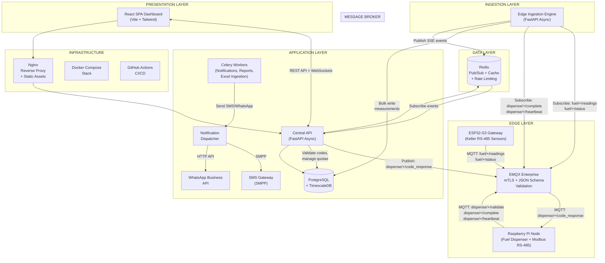
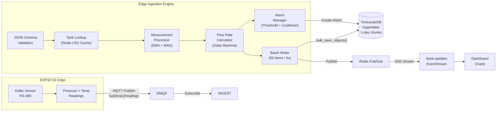
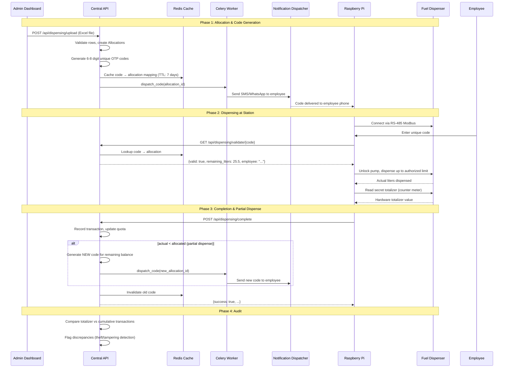
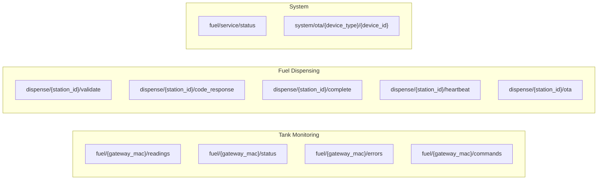
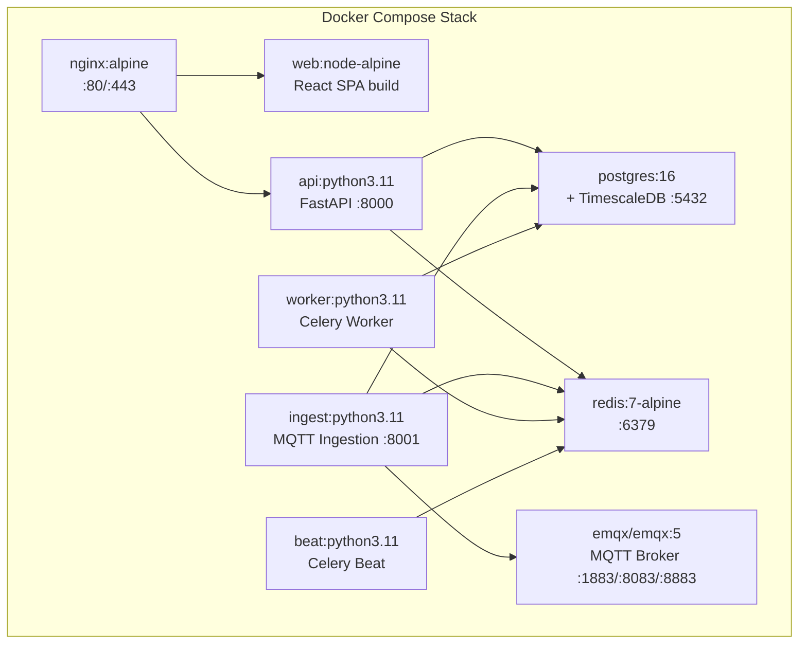

# Cloud Fuel & Dispensing Platform — System Architecture

## High-Level Architecture Overview

## Data Ingestion Pipeline — Tank Monitoring

## Fuel Dispensing Pipeline

## MQTT Topic Architecture

## Service Topology

