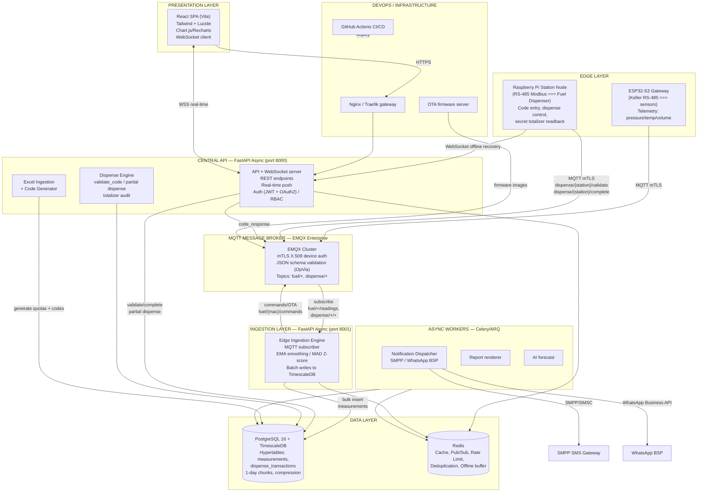
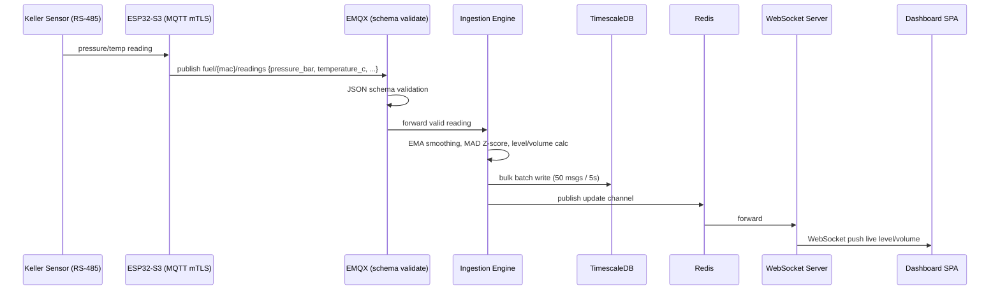
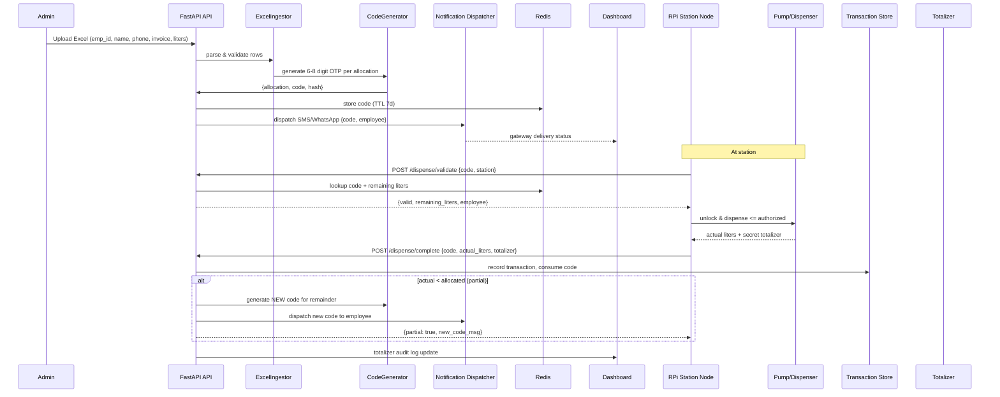
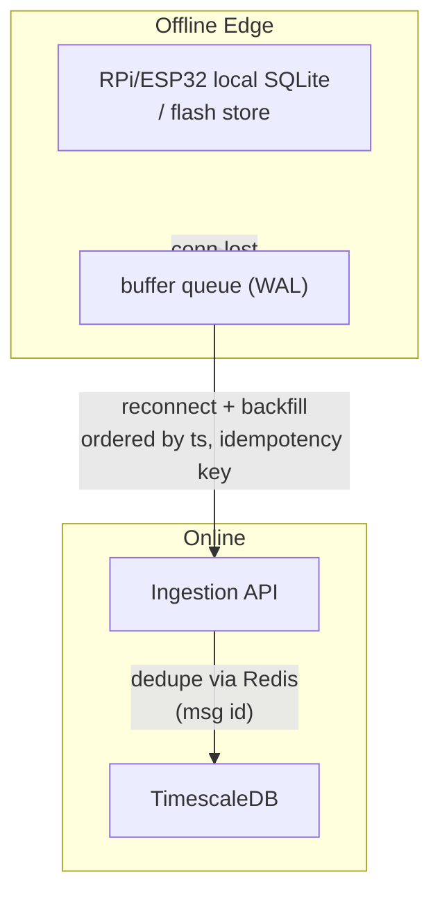

# Cloud Fuel & Dispensing Platform — Architecture

## 1. High-Level System Architecture



## 2. Tank Monitoring Telemetry Flow



## 3. Fuel Dispensing & Code Allocation Flow



## 4. Offline Buffering & Backfill



## 5. DDR Collision of Technology Choices

```mermaid
pie title Component Runtime
    "FastAPI Edge Ingestion" : 25
    "FastAPI Central API" : 25
    "React SPA (Vite)" : 15
    "PostgreSQL/TimescaleDB" : 15
    "Celery/ARQ Workers" : 10
    "EMQX MQTT" : 10