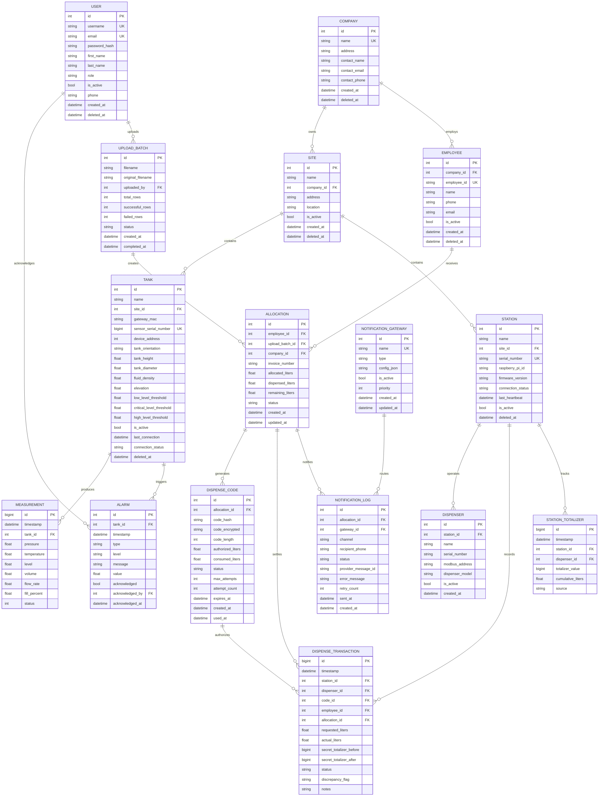

# Entity-Relationship Diagram — Cloud Fuel & Dispensing Platform

## Complete ERD



## Table Details

### TimescaleDB Hypertables
| Table | Partition Column | Chunk Interval | Compression | Retention |
|---|---|---|---|---|
| `measurements` | `timestamp` | 1 day | 7 days | 90 days |
| `dispense_transactions` | `timestamp` | 1 day | 7 days | 365 days |
| `station_totalizers` | `timestamp` | 1 day | 7 days | 365 days |

### Dispense Code Lifecycle
```
GENERATED → ACTIVE → CONSUMED (full) 
                 └──→ PARTIAL (converted to new allocation + new code)
                 └──→ EXPIRED (TTL)
                 └──→ REVOKED
```

### Allocation Status
```
PENDING → PARTIAL_FULFILLED → FULFILLED
                └──→ EXPIRED
                └──→ VOID
```